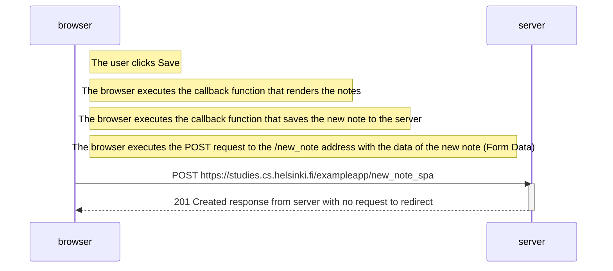

```mermaid
sequenceDiagram
    participant browser
    participant server

    Note right of browser: The user clicks Save
    Note right of browser: The browser executes the callback function that renders the notes
    Note right of browser: The browser executes the callback function that saves the new note to the server
    Note right of browser: The browser executes the POST request to the /new_note address with the data of the new note (Form Data)
    browser->>server: POST https://studies.cs.helsinki.fi/exampleapp/new_note_spa
    activate server
    server-->>browser: 201 Created response from server with no request to redirect
    deactivate server
```