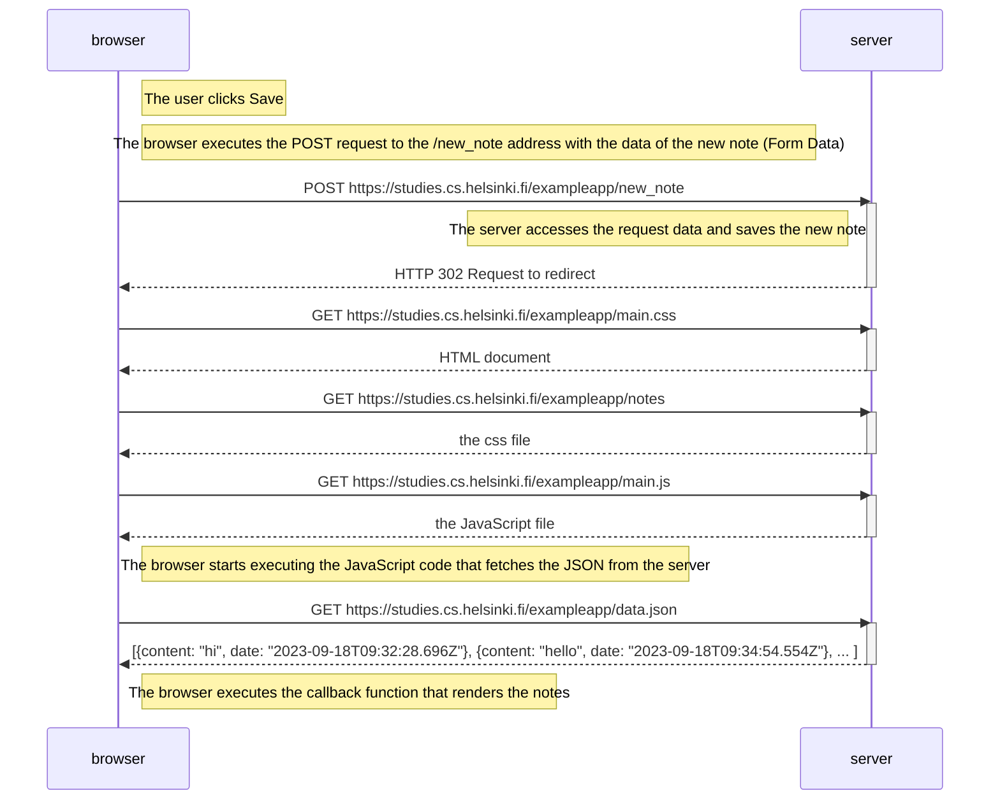

```mermaid
sequenceDiagram
    participant browser
    participant server

Note right of browser: The user clicks Save
Note right of browser: The browser executes the POST request to the /new_note address with the data of the new note (Form Data)
    browser->>server: POST https://studies.cs.helsinki.fi/exampleapp/new_note
    activate server
    Note left of server: The server accesses the request data and saves the new note 
    server-->>browser: HTTP 302 Request to redirect
    deactivate server

    browser->>server: GET https://studies.cs.helsinki.fi/exampleapp/main.css
    activate server
    server-->>browser: HTML document
    deactivate server

    browser->>server: GET https://studies.cs.helsinki.fi/exampleapp/notes
    activate server
    server-->>browser: the css file
    deactivate server

    browser->>server: GET https://studies.cs.helsinki.fi/exampleapp/main.js
    activate server
    server-->>browser: the JavaScript file
    deactivate server

    Note right of browser: The browser starts executing the JavaScript code that fetches the JSON from the server

    browser->>server: GET https://studies.cs.helsinki.fi/exampleapp/data.json
    activate server
    server-->>browser: [{content: "hi", date: "2023-09-18T09:32:28.696Z"}, {content: "hello", date: "2023-09-18T09:34:54.554Z"}, ... ]
    deactivate server

    Note right of browser: The browser executes the callback function that renders the notes
```